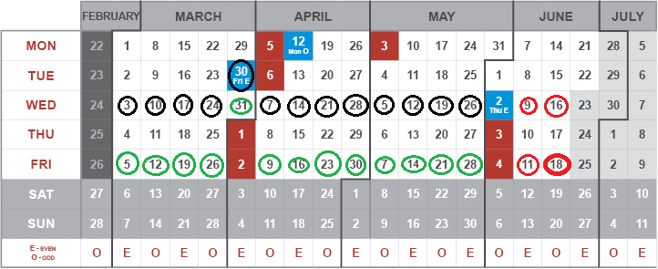

Googledoc document with links [HERE](https://docs.google.com/spreadsheets/d/1IK8AE2Pe77JtQBnO-fBYLQZ87U3I5z5a7VCKhyHGU7I/edit?usp=sharing).

# Challanges
1. Kinematics - due to 10th March 2021: [LINK](https://kahoot.it/challenge/08736132?challenge-id=459c69ba-0699-474d-ae7d-12916780bd23_1614952577307)
2. Dynamics - due to 17th March 2021: [LINK](https://kahoot.it/challenge/04307658?challenge-id=459c69ba-0699-474d-ae7d-12916780bd23_1615325575325)
3. Rotational Motion - due to 24th March 2021: [LINK](https://kahoot.it/challenge/02469638?challenge-id=459c69ba-0699-474d-ae7d-12916780bd23_1615632003886)
4. Harmonic motion & Gravitational field - due to 31st March 2021: [LINK](https://kahoot.it/challenge/08277847?challenge-id=459c69ba-0699-474d-ae7d-12916780bd23_1616330848956)
5. Relativistic phenomena
      
    **Homework: 1# Mechanics:  due to 9th April 2021** - email

6. Thermodynamics
7. Fluids
      
    **Homework: 2# Termodynamics:  due to 14th May 2021** - email

8. Electrostatics
9. Electric curent
10. Magnetism

**According to the rector's ordinance, no classes take place locally. Therefore, all materials related to the course will appear successively here**

**If you have any questions, don't hesitate to email me.**

# Physics
Lectures and excercises in Physics for foreigners conducted in spring 2020/21.

For more information look at [The Department of Foreign Languages page](http://sjo.pwr.edu.pl/en/students/courses-preparing-for-studying-in-poland/preparatory-english-courses).

## Outline

0. **Introduction - Physics rules the world** - 3.03.2021 *(ZOOM)*
1. **Motion phenomena - Kinematics** - 3.03.2021 & 5.03.2021 *(ZOOM)*
2. **Motion phenomena - Dynamics** - 10.03.2021 & 12.03.2021 *(ZOOM)*
3. **Rotational motion** - 17.03.2021 & 19.03.2021 *(ZOOM)*
4. **Harmonic motion, gravitational field** - 24.03.2021 & 26.03.2021 *(ZOOM)*
5. **Relativistic phenomena** - 30.03.2021 & 31.03.2021 *(ZOOM)*
6. **Basics of Thermodynamics** - 7.04.2021 & 9.04.2021 *(ZOOM)*
7. **Principles of Thermodynamics** - 14.04.20201 & 16.04.2021 *(ZOOM)*
8. **Fluids Statics** - 21.04.2021 & 23.04.2021 *(ZOOM)*
9. **Fluids Dynamics** - 27.04.2021 & 30.04.2021 *(ZOOM)*
10. **Electrostatics** - 5.05.2021 & 7.05.2021 *(ZOOM)*
11. **Electric current** - 12.05.2021 & 14.05.2021 *(ZOOM)*
12. **Magnetic field** - 19.05.2021 & 21.05.2021 *(ZOOM)*
13. **Vibrations and electromagnetic waves** - 26.05.2021 & 28.05.2021 *(ZOOM)*
14. **REVISION of Electricity and Magnetism** - 3.06.2021 (ZOOM)
15. **REVISION of Heat, Termodynamics and Fluids** - 5.06.2021 (ZOOM)
16. **REVISION of Kinematics, Dynamics and Relativity** - 17.06.2021 (ZOOM)
17. **Final grades & improvements** - 20.06.2021 (ZOOM)
